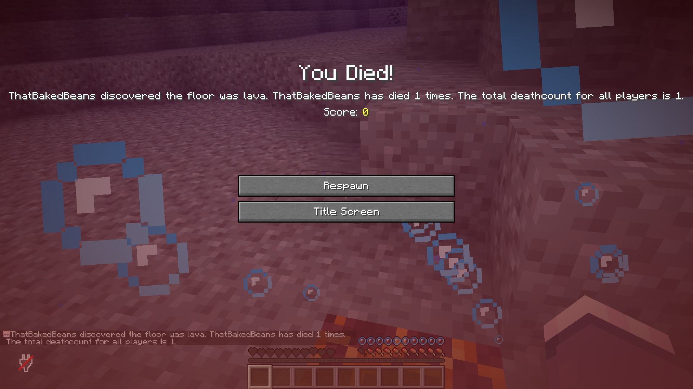

# Deathcount

This Minecraft Paper plugin counts the amount of deaths that each player has, and announces it server-wide once they die again.

You can configure the following options in plugins/Deathcount/config.yml:
- `show-total-deathcount`: Toggle "The total deathcount for all players is [all player's death count]." message.

## Commands
`/deathcount:setdeathcount set <deaths> <target>`

The permission name is `deathcount.setdeathcount.use` for LuckPerms and similar things.

## TODO

- Reset counts with commands
- Configurable messages
- Update and add images