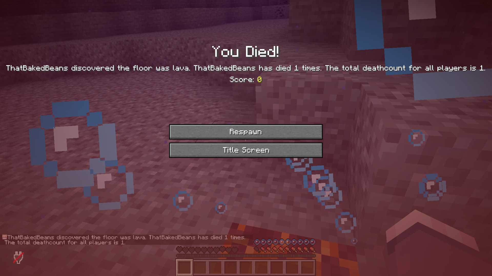

# Deathcount

This Minecraft Paper plugin counts the amount of deaths that each player has, and announces it server-wide once they die again.

You can configure the following options in plugins/Deathcount/config.yml:
- `show-total-deathcount`: Toggle "The total deathcount for all players is [all player's death count]." message.

## Spigot Support
Note that there is a Spigot version available, but it is very bare-bones and only implements death counters and only modifies the death messages in chat.
Please use the Paper version if you are able to.

## Warning
If your world save data directory is not named "world", this plugin will not work.
You usually won't have to worry about this since the directory is named "world" by default.

## Commands
`/deathcount:setdeathcount set <deaths> <target>`

The permission name is `deathcount.setdeathcount.use` for LuckPerms and similar things.

## TODO

- Configurable messages
- Update and add images